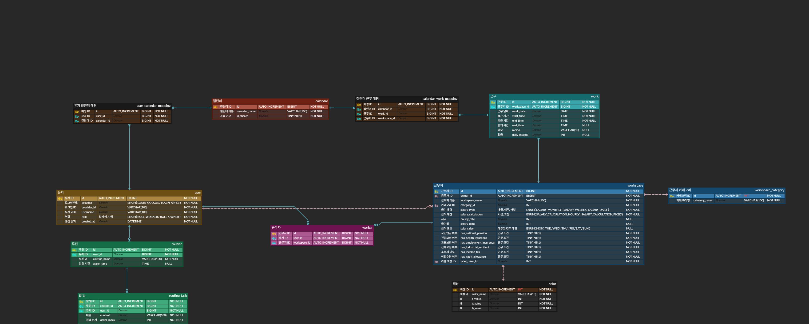

# ERD

---
## 이슈
### ✔ Soft Delete
- 예: `users`, `workspaces`, `works` 등에서 실제 삭제 대신 `is_deleted` 컬럼으로 관리 → 추적성, 복구 가능
  - 계정 탈퇴 시 3일의 유예 기간 있으므로 개발 확정
- 3일 유예 기간 구현을 위해 deletedAt으로 시간을 기록하고 isDeleted를 True로 바꾸는 식으로 구분
- 탈퇴 API 호출 시 유저 토큰 삭제
- 리눅스 cron 기능으로 매일 0시마다 isDeleted = True이며 currentDate() - deletedAt이 3day가 넘는 사람은 삭제
